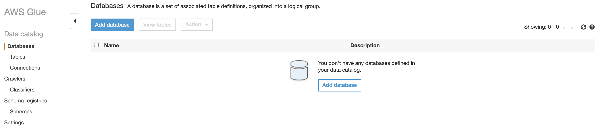
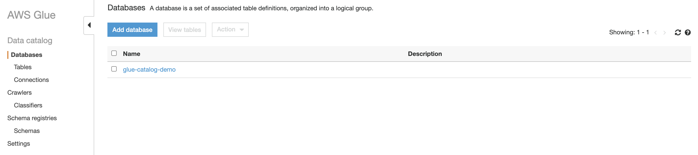
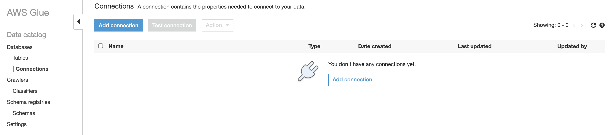
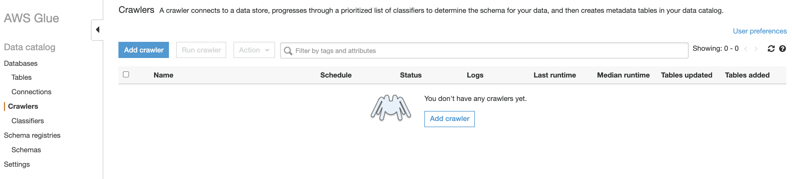
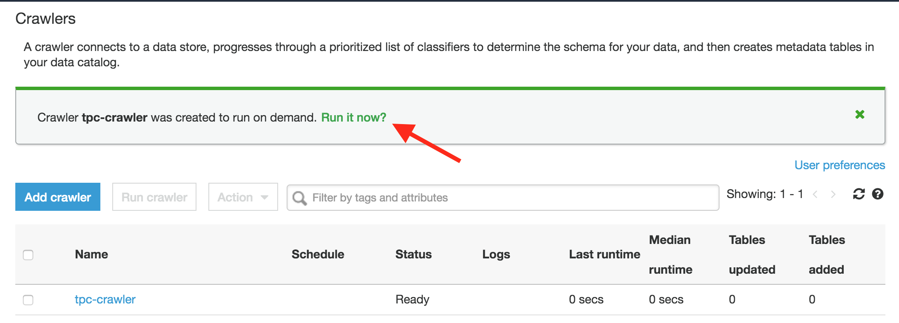
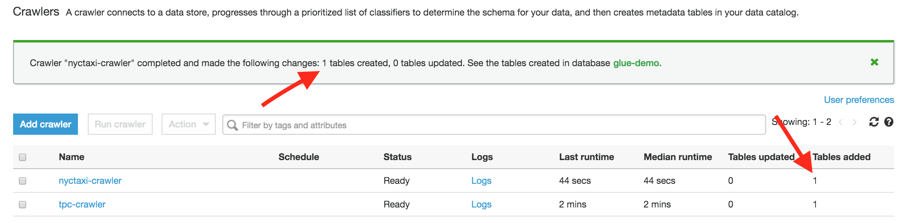

## Introduction

- Glue Data Catalog is an AWS native service that allows persisting, tag, and extends metadata in a similar fashion like an Apache Hive metastore. Every AWS account holds one AWS Glue Data Catalog in every region. 

- It offers a consistent store where multiple sources can persist and lookup metadata to organize the data and leverage it to query and transform the data.

- Following are the additional extensions to Glue Data Catalog:

    - Glue Crawler: Identify new data, draw out schema definitions, similarly like Hive style partitions on Amazon S3.

    - Glue Connection: Connections are leveraged by crawlers and jobs in AWS Glue to read certain types of data storage

    - Glue Classifier: A classifier queries the data in a data store. If it identifies the format of the data, it creates a schema. It also offers a set of built-in classifiers, but we can also create custom classifiers

- Following are the Glue Data Catalog components:
  
    - Database

      - A database is a collection of tables in AWS Glue. When we deploy a table in the AWS Glue Data Catalog, it is defined under a database

      - Following are the steps to define a database under AWS Glue Data Catalog

          1. Traverse to the <a href="https://console.aws.amazon.com/glue/">AWS Glue</a> and Click on the Databases option on the left

             

          2. Now, select the Add database button

          3. Provide Database name and select the Create button 

              
 
  - Connection
  
      - Following are the steps to define a connection under AWS Glue Data Catalog

          1. Traverse to the <a href="https://console.aws.amazon.com/glue/">AWS Glue</a> and Click on the Connection option on the left

             

          2. Now, provide connection details such as Connection Name, Connection type, and Database engine and click Next

          3. Now, provide DB instance details such as DB InstanceName, DB Name, UserName, and Password and click Next 

          4. Verify all the information, and click Finish.

          5. Select the connection deployed and click on Test connection to verify the connection 

          6. Provide the IAM role and click Test connection 

  - Crawling JDBC
  
      - Following are the steps to define a JDBC crawler under AWS Glue Data Catalog

          1. Traverse to the <a href="https://console.aws.amazon.com/glue/">AWS Glue</a> and Click on the Crawlers option on the left

             

          2. Provide a name for the Crawler name and select Next

          3. Choose Data stores as the Crawler source type

          4. Now, provide Crawler details such as Crawler type (S3/JDBC/DynamoDB), Connection Name, and Include path (schema/database) and click Next 

          5. We can add one more data source to crawl but we will crawl only one data store, so choose No and click Next

          6. Provide the IAM role and choose Next

          7. Next, we will define a scheduler for the crawler which can be hourly, daily, weekly, month, custom, or on-demand. After defining the schedule click Next 

          8. In this step, we will decide where to store the crawler's output. Choose database name from the list, provide prefix and leave the rest of the options as default. After that click next

          9. Verify all the information, and click Finish 

          10. When the crawler is newly created, Click on Run it now link

              

          11. Now go back to Databases -> Tables, click on the table, it will display table metadata, inferred schema, and its properties

  - Crawling S3 
   
      - Following are the steps to define an S3 crawler under AWS Glue Data Catalog

          1. Traverse to the <a href="https://console.aws.amazon.com/glue/">AWS Glue</a> and Click on the Crawlers option on the left

             

          2. Provide a name for the Crawler name and select Next

          3. Choose Data stores as the Crawler source type

          4. Now, select S3 as Crawler type and input path (S3 location which needs to be crawled) and click Next 

          5. We can add one more data source to crawl but we will crawl only one data store, so choose No and click Next

          6. Provide the IAM role and choose Next

          7. Next, we will define a scheduler for the crawler which can be hourly, daily, weekly, month, custom, or on-demand. After the defining schedule click Next  
          
          8. In this step, we will decide where to store the crawler's output. Choose database name from the list, provide prefix and leave the rest of the options as default. After that click next

          9. Verify all the information, and click Finish 
        
          10. When the crawler is newly created, Click on Run it now link
    
              
        
          11. Now go back to Databases -> Tables, click on the table, it will display table metadata, inferred schema, and its properties
